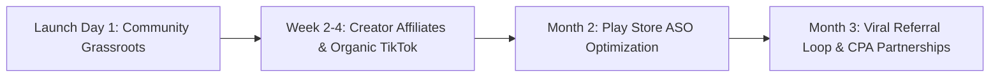

# AutoMileage: Go-To-Market (GTM) & User Acquisition Strategy
**Author:** Kent, Marketing Director  
**Report to:** Patrick (CEO)  
**Product:** AutoMileage: 1099 Tax Tracker (v1.0.0 Android)  

---

## 1. Competitive Positioning Matrix

| Feature / Attribute | AutoMileage | MileIQ | Everlance | Stride |
|:---|:---:|:---:|:---:|:---:|
| **Pricing Model** | **Free / One-time Pro** | $5.99/mo ($59.99/yr) | $8.00/mo ($60/yr) | Free (Ad-supported / Insurtech lead gen) |
| **Drive Limits** | **Unlimited Free** | 40 drives/mo limit | 30 drives/mo limit | Unlimited |
| **Privacy & Storage** | **100% Offline / Local** | Cloud Hosted | Cloud Hosted | Cloud Hosted |
| **Download Size** | **1.45 MB** | ~75 MB | ~85 MB | ~90 MB |
| **Battery Drain** | **< 1.8% / 8-hr shift** | 5%–10% | 6%–12% | 4%–8% |
| **True Net Income Calc** | **Built-in Native** | ❌ No | ❌ No | ❌ No |
| **1099 Expense Logger** | **Integrated Schedule C** | Mileage only | Extra tier required | Basic |
| **No Account / Signup** | **Instant 0-Second Onboarding** | Mandatory Sign-up | Mandatory Sign-up | Mandatory Sign-up |

### Core Value Proposition & Wedge
> *"The only 100% private, ultra-lightweight mileage & 1099 tax tracker with zero subscription paywalls, no cloud tracking, and a built-in True Net take-home calculator."*

---

## 2. Target Audience Personas

### Persona A: "Rideshare Ron" (Uber & Lyft Driver)
- **Pain Points:** Runs 10-12 hour shifts, battery drains fast with Uber/Lyft + GPS running simultaneously. Hit with unexpected $4,000+ tax bills at year-end.
- **Hook:** *"Don't let MileIQ lock your drives behind a $60 paywall. AutoMileage tracks every mile with zero limits and saves battery."*
- **Primary Channels:** Reddit (`r/uberdrivers`, `r/lyftdrivers`), Uber driver Facebook groups, YouTube Rideshare influencers.

### Persona B: "Dasher Dani" (DoorDash & Instacart Courier)
- **Pain Points:** Makes multiple short trips (2-5 miles). Needs to track parking tickets, tolls, hot bag expenses, and gas receipts in one place.
- **Hook:** *"Calculate your TRUE hourly earnings after gas and write-offs before tax day."*
- **Primary Channels:** Reddit (`r/doordash_drivers`, `r/couriersofreddit`), TikTok #doordashdriver, Discord gig-work servers.

### Persona C: "Independent Ian" (Freelancer / Real Estate Agent)
- **Pain Points:** Hates complex accounting software; just wants an IRS-compliant CSV to hand to their CPA every April without paying monthly SaaS subscriptions.
- **Hook:** *"1-tap audit-ready Schedule C export. 100% private on your phone."*
- **Primary Channels:** LinkedIn 1099 communities, Real Estate forums, Local CPA recommendations.

---

## 3. Multi-Phase User Acquisition Playbook

### Phase 1: Grassroots Community Seeding (Days 1–14)
- **Reddit Infiltration:** Publish authentic, value-first posts on `r/uberdrivers`, `r/doordash_drivers`, and `r/personalfinance`:
  - Title: *"Built a 1.5MB free mileage tracker for gig workers because I got sick of MileIQ charging $60/yr and draining battery. 100% offline, zero ads."*
- **Play Store Review Seeding:** Direct early adopters to rate 5 stars on Google Play to establish initial social proof (>4.7 rating).

### Phase 2: Micro-Influencer & Creator Outreach (Weeks 2–6)
- Partner with 15–20 mid-tier YouTube & TikTok creators who teach gig delivery hacks (e.g., "Your Driver Mike", "Rideshare Professor", DoorDash side-hustle channels).
- Provide custom referral links and feature their reviews on our Play Store listing.

### Phase 3: ASO & Search Domination (Ongoing)
- Target high-intent, high-volume search queries: `mileage tracker`, `uber tax deduction`, `doordash mileage`, `irs schedule c mileage`.
- Maintain our A/B tested Feature Graphic and framed showcase screenshots.

---

## 4. Key Performance Indicators (KPI Targets)

| Metric | Day 30 Target | Day 60 Target | Day 90 Target |
|:---|:---:|:---:|:---:|
| **Total Downloads** | 2,500 | 10,000 | 35,000 |
| **Play Store Rating** | ≥ 4.7 ★ | ≥ 4.7 ★ | ≥ 4.8 ★ |
| **Day-30 User Retention** | 42% | 45% | 48% |
| **Drives Classified/User** | 18 drives/week | 22 drives/week | 25 drives/week |
| **CSV Reports Exported** | 400 | 2,200 | 8,500 |

---

## 5. Monetization & Growth Opportunities (Future Roadmap)
1. **Free Core Tier:** 100% unlimited automatic drive logging and local storage (permanent wedge).
2. **Pro Power-Pack ($2.99/mo or $19.99 lifetime):**
   - Automated Google Drive / Dropbox receipt sync
   - Multi-vehicle fleet tracking
   - Direct TurboTax / QuickBooks API sync
3. **CPA Referral Network:** Revenue-share model connecting gig workers directly to 1099 tax filing specialists.
